# Insurance_company_premium

This projects mainly focus on the insurance dataset. And, testing all sorts of machine learning models on the datasets.
Datasets are obtained from Kaggle. [Insurance company premium](https://www.kaggle.com/code/rax007/insurance-company-premium) is mainly used to test all models.
 
* In this project, there are a total of 20 Machine Learning Models, including 4 Boosting models, 1 Stacking model, and 1 ANN(TensorFlow DNN) model.
* There are example notebooks from Kaggle. If you want to know further details and try something, you can read them.   

### Challenges and Notes
* You can also see there is imbalanced target datasets and most Kaggle notebook train and test without oversampling. 
* Therefore the accuracies of models are higher in testing with the normal dataset. But you will find there is overfit when predicting the minor class.
* Models are needed to adjust and hyperparameter tuning is needed. 

### Finding 
* Oversampling models take longer to train and results are not as good as normal dataset models. 
* Although oversampling models are low accuracy results, the confusion matrix shows a quite satisfactory result. Of course, models need to be tuned. 
* The normal dataset results are high but the confusion matrix shows results of the minor class classification are only 60-70% accurate. 
* Random forest, Stacking, Xgboost and ANN models are quite promising and you can fine-tune these models to get good results.
    

## Result Table
Title                  |  With SMOTE                                      |  Without SMOTE
:---------------------:|:------------------------------------------------:|:-----------------------------------------------------:
All model f1 score     | 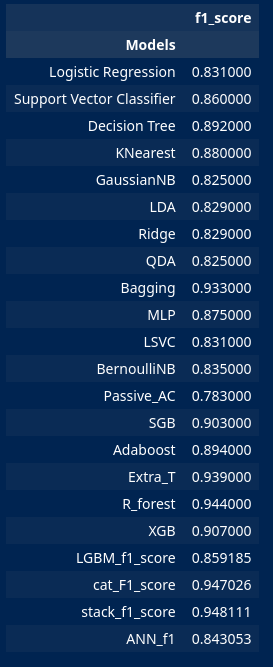     | 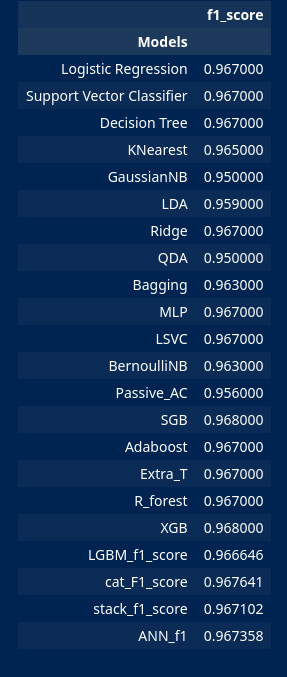
All model f1 score plot|| 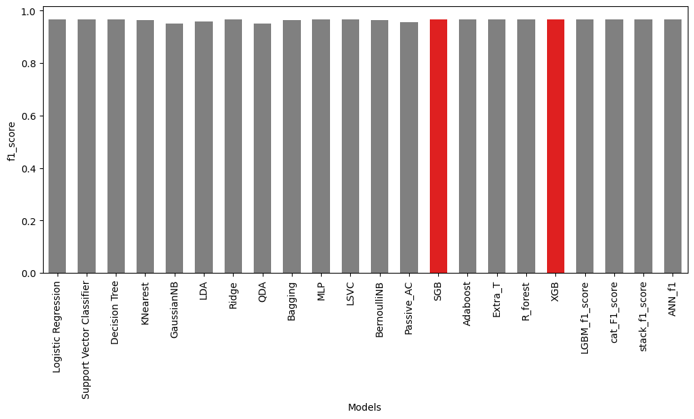
logistic               | 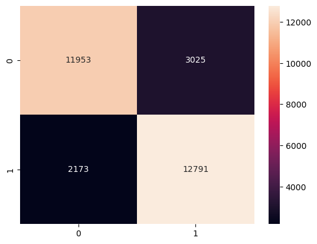        |  
Bagging                |          | 
CatBoost               | 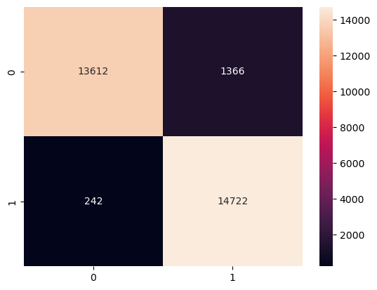             | 
Extra Tree             | 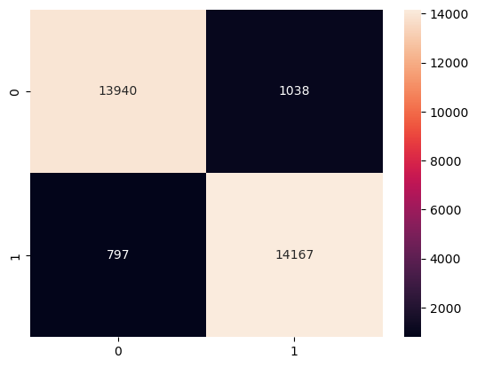      | 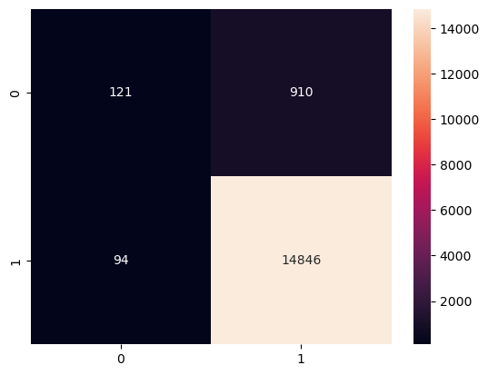
Random forest Tree     | 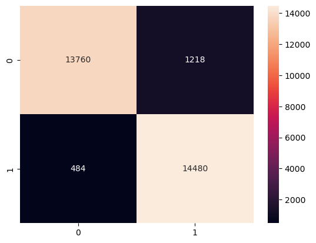   | 
Stacking model         | 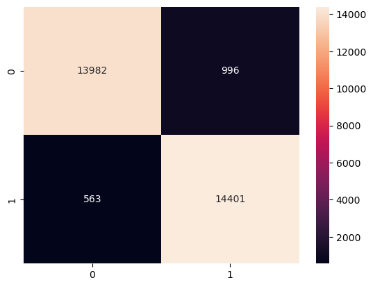        | 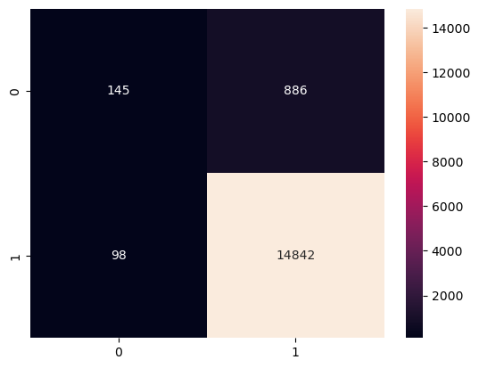
ANN Matrix             | 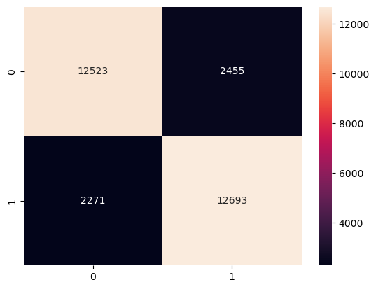             | 
ANN Accuracy           | 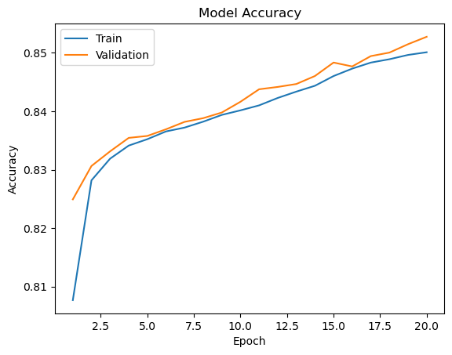           | 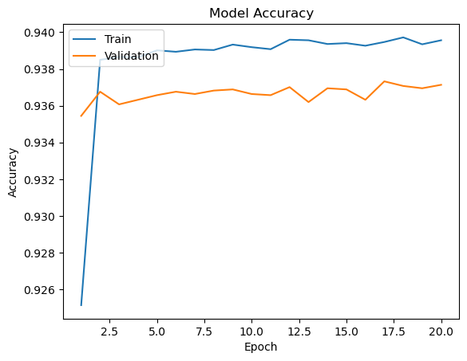
ANN Loss               | 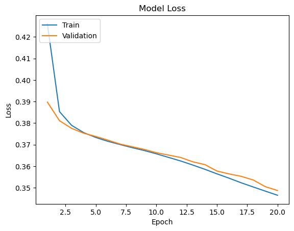               | 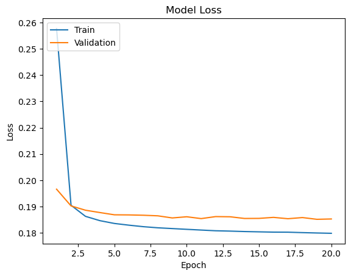

## Further Study 
* fine-tune the model to get high accuracy and reduce FP and FN.
* KFolding and Grid searching are necessary to know the dataset better.

